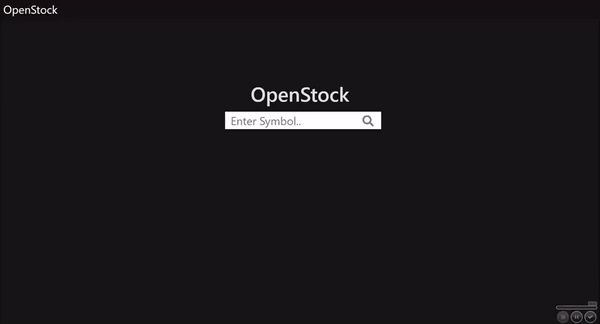
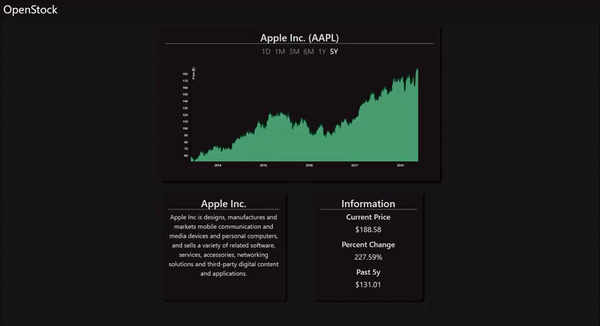

# OpenStock
A Data Visualization App for Stocks on the S&P 500 List.
Made using Node.js, PostGreSQL, ReactJS, ExpressJS
# Why?
Because I thought it would be cool to put my own implementation of the standard stock viewing app.
And wanted to learn how to utilize d3js to build dynamic and responsive graphs.
# Technologies Used
* ReactJS: React-Router
* D3JS, Bootstrap
* NodeJS: ExpressJS BCrypt
* PostGreSQL
* HTML, CSS, Javascript, ES6
* IEX EXCHANGE Developer API
# Demo 

  
  

